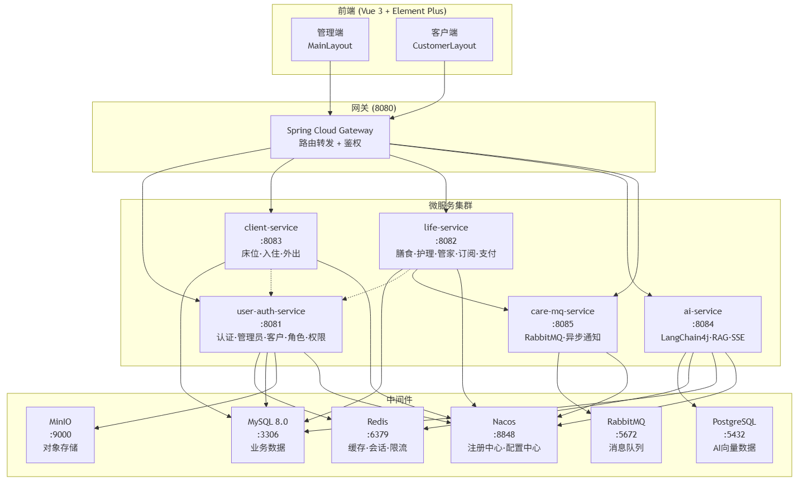
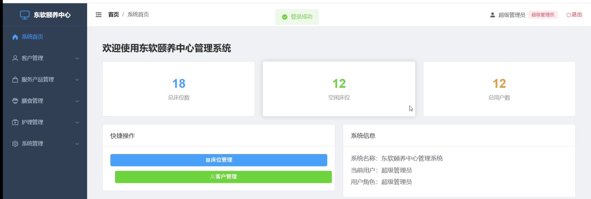

# 东软颐养中心微服务管理系统

> 基于 Spring Cloud Alibaba 微服务架构的养老机构全流程管理平台
>
> 项目周期：2026.06 - 2026.07 | 独立开发

---

## 项目架构图




---

## 技术栈

| 层级 | 技术 |
|------|------|
| 基础框架 | Spring Boot 2.7.18 / Spring Cloud Alibaba 2021.0.8 |
| 认证授权 | Sa-Token 1.39.0（JWT + Redis 混合模式） |
| 业务数据库 | MySQL 8.0 |
| 向量数据库 | PostgreSQL + pgvector |
| 缓存 | Redis（Spring Cache + 自定义 TTL） |
| 消息队列 | RabbitMQ（Direct 交换机） |
| 注册配置中心 | Nacos |
| 对象存储 | MinIO（MD5 去重） |
| AI 框架 | LangChain4j 0.33.0 + DashScope 通义千问 |
| 前端 | Vue 3 + Element Plus + Pinia |

---

## 项目结构

```
care-cloud/
├── gateway-service/          # Spring Cloud Gateway 网关 :8080
├── user-auth-service/        # 认证授权/管理员/客户/角色权限 :8081
├── life-service/             # 膳食/护理/管家/订阅/支付 :8082
├── client-service/           # 床位/入住/外出管理 :8083
├── ai-service/               # LangChain4j AI 助手 :8084
├── care-mq-service/          # RabbitMQ 异步通知 :8085
├── care-common/              # 公共模块（实体/配置/工具）
├── care-cloud-frontend/      # Vue 3 前端
└── sql/                      # 数据库初始化脚本
```

---

## 核心亮点

### 1. 分布式认证与权限管理

- **Mixin 模式选型**：对比 Sa-Token 三种认证模式（纯无状态 JWT / 有状态 Session / Mixin 混合），最终选择 Mixin——令牌仍是 JWT 格式支持无状态校验，同时 Redis 维护会话映射，为后续踢人下线等有状态操作打下基础
- **RBAC 五表权限模型**：admin → admin_role → role → role_permission → permission，支持树形菜单 + 按钮级权限控制
- **缓存"先删后加"策略**：权限码登录时从数据库四表联查写入 Redis Set，覆盖旧缓存；无 TTL，彻底解决 Token 还在有效期但权限码已过期的 403 问题
- **登录安全**：失败 5 次锁定 5 分钟（Redis 计数 + 自动过期）


### 2. AI 智能问答助手

- **RAG 检索增强生成**：LangChain4j + 阿里通义千问，text-embedding-v4 模型（1024 维）将业务文档向量化存入 PgVector
- **语义检索**：用户提问后 Top5 余弦相似度检索，拼接增强 Prompt 后调用千问模型生成回答
- **流式推送**：SSE（Server-Sent Events）逐字推送前端
- **对话记忆**：Redis 存储最近 10 条对话上下文，24 小时自动过期


### 3. 支付宝支付 + 最终一致性保障

- **沙箱支付**：对接支付宝 PC 端支付，RSA2 异步验签
- **状态机乐观锁**：订单状态字段 `WHERE status='PENDING'` 防重复回调
- **MQ 异步解耦**：支付成功后通过 RabbitMQ Direct 交换机投递通知


### 4. 跨服务协作与基础设施

- **Feign 声明式调用**：删除/禁用客户前调用 client-service 检查在住和外出记录，保持服务自治
- **RabbitMQ 独立模块**：3 个 Direct 交换机分别处理支付/入住/护理三类异步事件
- **Spring Cache 统一 TTL**：5 分钟兜底过期，覆盖管理员信息和空闲床位查询
- **MinIO + MD5 去重**：相同文件三维匹配（MD5 + 大小 + 类型）后直接返回已有路径

---

## 系统截图



*（需要你补充：运行项目后截一张 Dashboard 页面图）*

---

## 快速启动

### 前置条件

- JDK 17+
- MySQL 8.0 + PostgreSQL 15+
- Redis
- RabbitMQ
- Nacos 2.x
- MinIO（可选）
- Node.js 18+（前端）

### 启动步骤

```bash
# 1. 导入数据库
mysql -u root -p < sql/init.sql

# 2. 启动基础设施
# Nacos → Redis → RabbitMQ → MinIO

# 3. 启动后端微服务（按顺序）
cd care-cloud
mvn clean install -DskipTests
# 依次启动：
# user-auth-service → client-service → life-service
# → ai-service → care-mq-service → gateway-service

# 4. 启动前端
cd care-cloud-frontend
npm install
npm run dev
```


## 联系我

- GitHub：[zhaoxian03](https://github.com/zhaoxian03)
